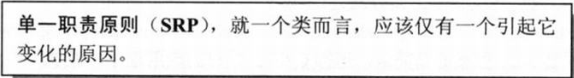
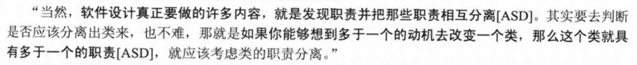
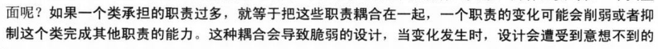

## 单一职责原则
### 官方解释

#### 单一职责原则

#### 单一职责原则判断标

#### 程序臃肿坏处

***

### 个人理解
单一职责原则即每个类或者模块的功能是具体的明确的。比如手机对应打电话，相机对应拍照片，摄影机对应拍视频;
当我们设计一个类时把过多的功能放到一起就违背单一职责原则设计思想,例如在手机上添加打电话,拍照片录视频等多种功能;

### 设计优点
> 降低类的复杂度,一个类值负责一项功能
> 提高类的可读性,可维护性
> 降低变更引起的风险
> 

