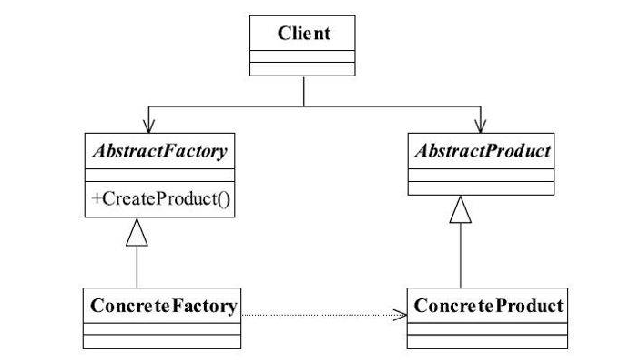

### 抽象工厂模式
#### 一、定义
为创建一组相关或相互依赖的对象提供一个接口，而且无须指定它们的具体类。

#### 二、优点
> **封装性**，每个产品的实现类不是高层模块要关心的，它要关心的是什么？是接口，是抽象，它不关心对象是如何创建出来，这由谁负责呢？工厂类，只要知道工厂类是谁，我就能创建出一个需要的对象，省时省力，优秀设计就应该如此。

> **产品族内的约束为非公开状态**。例如生产男女比例的问题上，猜想女娲娘娘肯定有自己的打算，不能让女盛男衰，否则女性的优点不就体现不出来了吗？那在抽象工厂模式，就应该有这样的一个约束：每生产1个女性，就同时生产出1.2个男性，这样的生产过程对调用工厂类的高层模块来说是透明的，它不需要知道这个约束，我就是要一个黄色女性产品就可以了，具体的产品族内的约束是在工厂内实现的。

#### 三、缺点
> 抽象工厂模式的最大缺点就是产品族扩展非常困难，为什么这么说呢？我们以通用代码为例，如果要增加一个产品C，也就是说产品家族由原来的2个增加到3个，看看我们的程序有多大改动吧！抽象类AbstractCreator要增加一个方法createProductC()，然后两个实现类都要修改，想想看，这严重违反了开闭原则，而且我们一直说明抽象类和接口是一个契约。改变契约，所有与契约有关系的代码都要修改，那么这段代码叫什么？叫“有毒代码”，——只要与这段代码有关系，就可能产生侵害的危险
- - - - 
>  我们从工厂方法模式切换到抽象工厂模式最主要是因为对于产品而言，其约束条件从一个(肤色)变成了两个(肤色+性别)，
> 而在抽象工厂模式中，我们是定义了一个抽象工厂然后选择其中一个条件作为具体工厂，再在具体工厂中分别实现另外一个条件，如在案例中，我们是将肤色作为抽象工厂，然后在工厂中创造不同的性别的人种。
> 这里我们选择创建工厂的条件和工厂中具体实现的条件时，最好是将可能会发生变化的条件作为工厂，将相对固定的条件作为具体实现。
> 这样在后期扩展中，如我们要新增一个棕色人种，就只需要新建一个棕色人种工厂并在其中实现创建棕色人种男性和女性的实现即可，然后添加具体人种实现类即可
> 而如果我么将性别作为工厂，将人种作为具体实现，那么后期如果要新增加人种就需要修改具体性别的实现工厂。