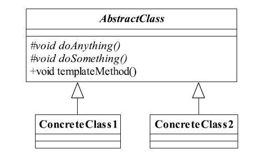

### 模板方法模式

#### 一、定义
定义一个操作中的算法的框架，而将一些步骤延迟到子类中。使得子类可以不改变一个算法的结构即可重定义该算法的某些特定步骤。

#### 二、优点
>  **封装不变部分，扩展可变部分**。把认为是不变部分的算法封装到父类实现，而可变部分的则可以通过继承来继续扩展。在悍马模型例子中，是不是就非常容易扩展？例如增加一个H3型号的悍马模型，很容易呀，增加一个子类，实现父类的基本方法就可以了。

> **提取公共部分代码，便于维护**。我们例子中刚刚走过的弯路就是最好的证明，如果我们不抽取到父类中，任由这种散乱的代码发生，想想后果是什么样子？维护人员为了修正一个缺陷，需要到处查找类似的代码！

> **行为由父类控制，子类实现**。基本方法是由子类实现的，因此子类可以通过扩展的方式增加相应的功能，符合开闭原则。

----
> 在模板方法模式中，我们将功能拆分为执行过程(模板方法)和具体细节(具体方法)两种。在抽象层，我们只定义具体的实现流程，将具体细节交给实现类来处理。
> 相当于在抽象层定义了一套规则(模板方法)，调用者只需要按照这套规则实现即可，至于说具体的实现是怎么写的我们并不用关心。
> 在后期如果需要新增另外一套逻辑，我们只需要继承抽象类然后实现具体的细节即可。
> 如我们实现一套启动车辆的流程，只需要在模板方法中定义 开门 - 点火 - 加速这一套流程即可，具体的是以什么方式开门，以什么方式点火加速都交给具体的实现类来根据自身需求实现。

